# ドメイン駆動設計をはじめよう

## はじめに

部門勉強会でなぜ「**ドメイン駆動設計**」をテーマとしたのか？
これはまさに**withAI時代に必須の学び**だと考えたからです。

みなさんが体感しているように、コーディングなどの定型作業はAIに取って代わられる可能性が高いと思います。
その中で、我々が顧客に価値を届けるために必要なものは、**ドメイン知識、および、それをどのようにシステムに落とし込むかというナレッジ**です。

本日は、ドメイン駆動設計の要点を絞ってお伝えします。

## 本日の目標

- ドメイン駆動設計の基本的な考え方を理解する
- **同じ言葉**を使って開発することの重要性を理解する (同じ言葉はユビキタス言語とも呼ばれます)
- イベントストーミングの手法を知る

## 目次

**第1部　設計の基本方針**

1章　事業活動を分析する
2章　業務知識を発見する
3章　事業活動の複雑さに立ち向かう
4章　区切られた文脈どうしの連携

**第2部　実装方法の選択**

5章　単純な業務ロジックを実装する　（トランザクションスクリプト、アクティブレコード）
6章　複雑な業務ロジックに立ち向かう　（ドメインモデル）
7章　時間軸でモデルを作る　（イベントソーシング、イベント履歴式ドメインモデル）
8章　技術方式
9章　通信

**第3部 ドメイン駆動設計の実践**

10章　設計の経験則
11章　設計を進化させる
12章　イベントストーミング
13章　現実世界のドメイン駆動設計

**第4部　他の方法論や設計技法との関連**

14章　マイクロサービス
15章　イベント駆動型アーキテクチャ
16章　データメッシュ

## 翻訳者の増田さんのスライドを見てみよう！

https://speakerdeck.com/masuda220/learning-domain-driven-design-2024-8-bpstuty-204

### 要点１ 本書の構成：事業方針とソフトウェア設計

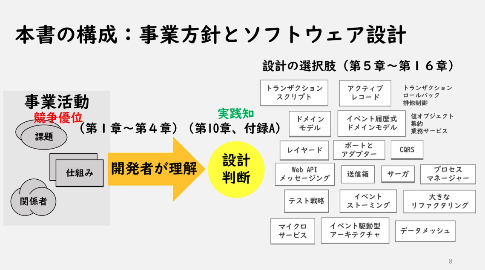

### 要点２ 業務領域のカテゴリーを特定する

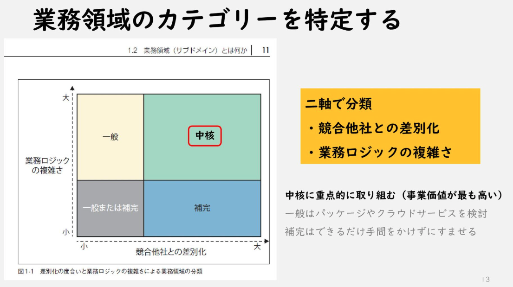

### 要点３ 事業戦略の視点から業務領域を分類

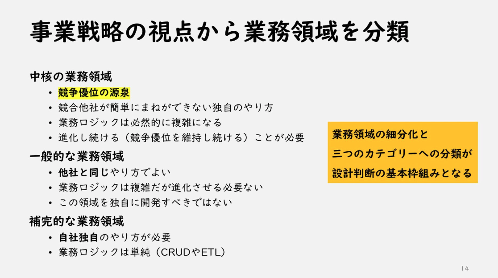

### 要点４ 「同じ言葉」の効果

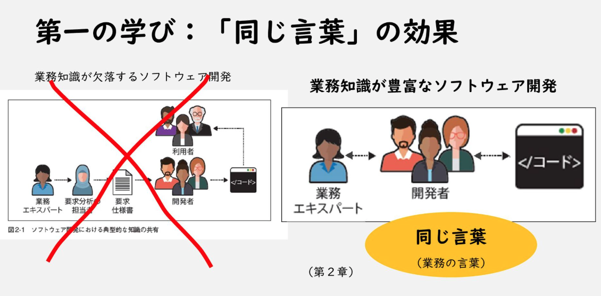

## 第1部
## 1章　事業活動を分析する

この章では、事業活動を理解するためのドメイン駆動設計の考え方とやり方を説明
すべては、事業領域を理解するところから始まる

事業目標を達成し競合する他社のサービスと差別化するための業務領域の細分化

**中核の業務領域**

他社との差別化を実現し競争優位を生み出すための活動領域

**一般の業務領域**

既存の解決手段が手に入る領域
どの会社も同じような活動をする

**補完的な業務領域**

自社で独自に解決する必要はあるが競争優位を生み出すことはない

## 2章　業務知識を発見する

プロジェクトを成功させるには、効果的な意図の伝達と知識の共有が極めて重要

ドメイン駆動設計の「**同じ言葉**」（ユビキタス言語）は、業務エキスパートとソフトウェア技術者の間の知識ギャップを埋める効果的な手法

会話、文書、テスト、図、そしてソースコードなど、あらゆるところで**同じ言葉**を使うことが重要

## 3章　事業活動の複雑さに立ち向かう

業務エキスパートによって業務の捉え方が異なることがある

こういう不整合に直面した場合「**同じ言葉**」を複数の「区切られた文脈」に分解することが重要

業務領域は「発見」するもの、それに対して区切られた文脈は「設計」するもの

## 4章　区切られた文脈(境界づけられたコンテキスト)どうしの連携

区切られた文脈は完全に独立しているわけではない
他の文脈と相互につながることが必要

- 良きパートナー
  - 連携する時にそれぞれのチームが臨機応変に対応
- モデルの共有
  - 必要最小限のモデルを共有
- 従属
  - サービスを利用する側が、提供側のモデルに合わせる
- モデル変換装置
  - 利用側が提供側のモデルを自分のモデルに合うように変換
- 共有サービス
  - 提供側が利用する側のニーズに最適化した公開された言葉を実装
- 互いに独立
  - 連携のために協力する労力よりも、同じ機能を重複して実装した方が負担が少ないときの選択肢 

## 第2部
## 5章　単純な業務ロジックを実装する

単純な業務ロジックの実装方法２つ

- トランザクションスクリプト
  - 単純でわかりやすい手続き的なスクルプととして記述
  - それぞれの手続きはトランザクションを管理
  
- アクティブレコード
  - 業務ロジックは単純だがデータ構造が複雑な場合に、データ構造をアクティブレコードオブジェクトとして実装

## 6章　複雑な業務ロジックに立ち向かう

複雑な業務ロジックを実装する方法

主要な部品
- 値オブジェクト（Value Object）
  - 業務で扱う値を表現する部品
  - 値で等価性を判断
  - 値オブジェクトはイミュータブル（不変）であることが重要
  - 値オブジェクトはデータとロジック（振る舞い）を持つ
- 集約 (Aggregate)
  - トランザクションの境界を共有するエンティティの階層構造
  - 集約の境界内部のデータは業務ロジックを正しく実装するために、強い一貫性を保証する必要がある
  - 集約の状態（内部に保持するオブジェクトも含む）を変更する方法は、外部に公開したインタフェースを通じてのみ行う
  - 集約はトランザクションの境界を定義する
  - 集約は外部のエンティティに対して業務イベントを発行して情報を伝達できる
- 業務サービス
  - 業務ロジックの置き場となる、状態を持たないオブジェクト

- エンティティ（Entity, A.K.A. Reference Object）
  - エンティティは値オブジェクトと対になる概念
  - 個々のインスタンスを特定する為の識別情報（ID）が必要
  - エンティティは変更可能なオブジェクトである

## 7章　時間軸でモデルを作る

イベントソーシングの応用として、ドメインモデルの集約を時間軸の視点でモデル化する手法を紹介

**イベント履歴式ドメインモデル**

- 集約の状態を変更する操作を業務イベントとして表現
- 集約の最新状態は業務イベントの履歴から投影する
- 業務データから深い洞察を得るために極めて重要

## 8章　技術方式

- レイヤードアーキテクチャー
  - プレゼンテーション層、サービス層、業務ロジック層、データアクセス層から構成される
  - アクティブレコードに適用するのが良い
- ポートとアダプター (Hexagonal Architecture)
  - レイヤードアーキテクチャの欠点を解消し、複雑な業務ロジックの実装に適する
  - 業務ロジックを中心におき、業務ロジックをすべての基盤コンポーネントから独立させる
  - https://nrslib.com/hexagonal-architecture/
  
- CQRS (Command Query Responsibility Segregation, コマンド・クエリ責任分離)
  - イベント履歴式ドメインモデルでは必須
  - 同じデータを複数のモデルで表現する

## 9章　通信

区切られた文脈を連携するための通信方法

- 送信箱 (Outbox)
  - 集約が発行する業務イベントを外部に確実に送信する方法
- Saga
  - 複数のシステムコンポーネント（区切られた文脈）にまたがる、単純の業務プロセスを実装する方法
- プロセスマネージャー
  - Sagaでは難しい、より複雑な業務プロセスを実装する方法

## 第3部
## 10章　設計の経験則

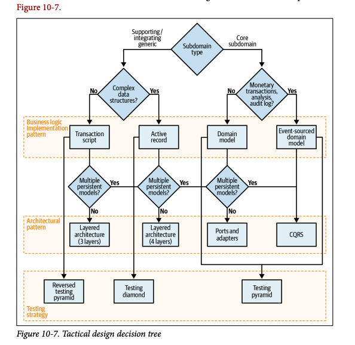

## 11章　設計を進化させる

ヘラクレイトスが有名な言葉で述べたように、「人生で唯一変わらないものは変化そのものです。」

ビジネスドメインについての学習は継続的なプロセスです。
時間とともに新たなドメイン知識が発見されるにつれて、それを戦略的・戦術的な設計判断の進化に活用する必要があります。

したがって：
- サブドメインの機能が拡張される際は、より良い設計判断を可能にするような、より細かい粒度のサブドメイン境界を識別するよう努めてください
- 区切られた文脈が「何でも屋」になることを許可しないでください
- 区切られた文脈に含まれるモデルが、特定の問題を解決することに焦点を当てているようにしてください
- 集約の境界をできるだけ小さく保ってください
- 強い一貫性のあるデータというヒューリスティックを使用して、ビジネスロジックを新しい集約に抽出する可能性を検出してください

この話題に関する最後の助言として、成長によって引き起こされる複雑性の兆候がないか、さまざまな境界を継続的にチェックしてください。偶発的な複雑性を排除するよう行動し、ドメイン駆動設計のツールを使用してビジネスドメインの本質的な複雑性を管理してください。

## 12章　イベントストーミング

### イベントストーミングとは何か？

EventStormingは、グループでビジネスプロセスをブレインストーミングし、迅速にモデル化するためのローテクな活動です。ある意味で、EventStormingはビジネスドメインの知識を共有するための実践的なツールと言えます。
EventStormingセッションには「スコープ」があります：それは、グループが探求したいと考えるビジネスプロセスのことです。参加者は、タイムライン上に付箋紙で表されたドメインイベントの連続として、そのプロセスを探求していきます。ステップバイステップで、モデルはアクター、コマンド、外部システムなどの追加的な概念で強化され、最終的にそのすべての要素がビジネスプロセスの仕組みを物語るようになります。

### イベントストーミングのステップ

#### Step1 : 発散的に探索する

イベントストーミングは探求する業務領域に関する**業務イベント**のブレインストーミングから始まります。
業務イベントは業務活動で起きた興味深い出来事（過去形で表現する）です。

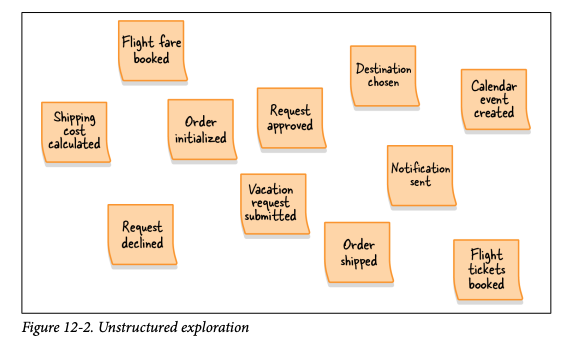

#### Step2 : 時系列に並べる

Step1で洗い出した業務イベントを確認し、時系列に並べます。
まず、「正常系のシナリオ」のフローからはじめてください。

正常系が完了したら「代替シナリオ」を追加します。
エラーが発生するシナリオ、異なる意思決定が行われるシナリオです。

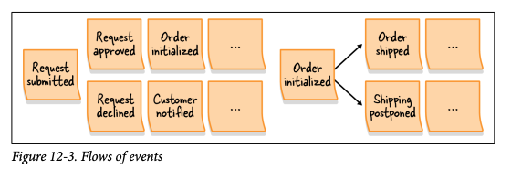

#### Step3 : 問題点を洗い出す

プロセス全体の中で注意が必要な点を特定します。
- ボトルネックになっている箇所
- 自動化できていない作業
- 文書かできていないものや業務知識が不足しているところ

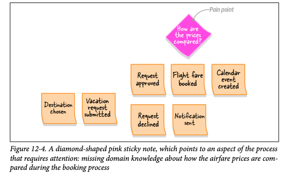

#### Step4 : 転換イベントを見つける

文脈やフェーズの変化を示す重要な業務イベントを探します。
これらのイベントを「転換イベント」(pivotal event)と呼びます。

たとえば、「ショッピングカートが初期化された」「注文処理が開始された」「注文が出荷された」「注文が配達された」「注文が返品された」などは、注文処理プロセスの重要な変化を表します。

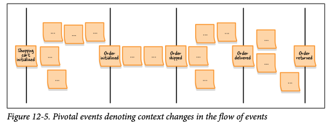

#### Step5 : コマンドを見つける

業務イベントは、すでに起こったことを説明します。
それにたいして「コマンド」は、イベントあるいはイベントのフローを引き起こすものを説明します。
何かを指示する形式で表現します。
- キャンペーンを公開する
- 処理を取り消す
- 注文を送信する
  
コマンドが生成するであろうイベントの前に貼り出します。

特定のアクターによって実行されるコマンドは、そのアクター情報を追記します。

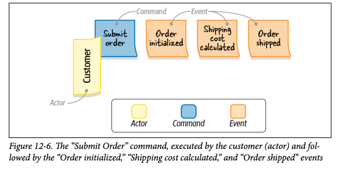

#### Step6 : ポリシーを定義する

コマンドのほとんどは、特定のアクターに関連づけられていません。
このステップでは、これらのコマンドを実行すると想定される「自動化ポリシー」を探します。
自動化ポリシーとは、あるイベントがコマンドの実行を引き起こすシナリオです。

コマンドがなんらかの判定条件を満たした場合にのみ実行されるんら、その判定条件も明記します。

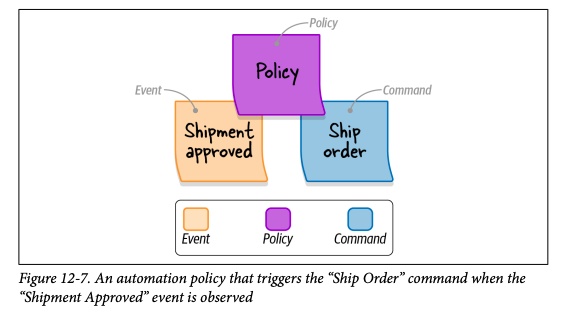

#### Step7 : 読み取りモデルを見つける

読み取りモデルは、アクターが、コマンドを実行するかどうかを判断するために使う、対象領域の状態を表現するデータのビューです。
画面、レポート、通知などが該当します。

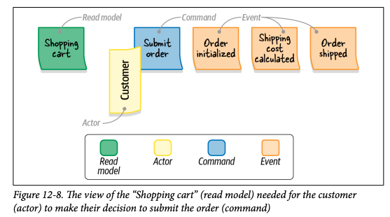

#### Step8 : 外部システムを追加する

このステップでは、外部システムを追加してモデルを拡張します。
外部システムとは、探求している業務領域の外側に存在するシステムの表現です。

コマンドを実行したり、イベントに関する通知を受けたりする可能性があるものが該当します。

このステップが終わった段階で、全てのコマンドは、
- アクターによって実行されるか
- ポリシーによって発動されるか
- 外部システムによって呼び出されるか

のいずれかになっているはずです。

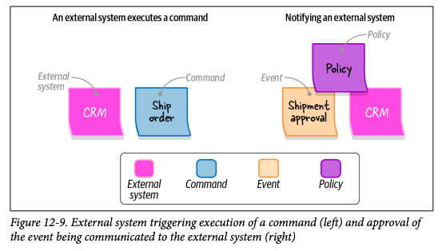

#### Step9 : 集約を見つける

全てのイベントとコマンドを洗い出したら、関連する概念を集約として整理します。
集約はコマンドを受け取り、イベントを生成します。

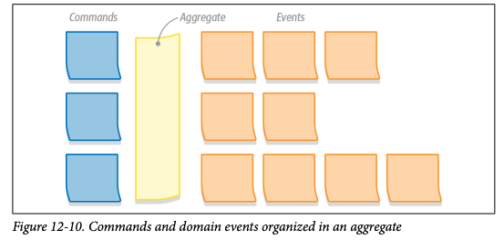

#### Step10 : 区切られた文脈に分割する

イベントストーミングセクションの最後のステップとして、機能的に密接に関係していたり、自動化ポリシーを介して結合されていたりする集約を探します。
このような集約の集まりが、**区切られた文脈**の境界の自然な候補となります。

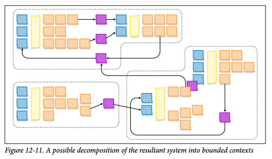

### まとめ

イベントストーミングは、業務プロセスをモデリングするための協調型ワークショップです。
業務プロセスのモデルが手に入るだけでなく、知識を共有できることが主な利点です。
イベントストーミングが終わる頃には、参加者全員が、業務プロセスのメンタルモデルを持ち、同じ言葉を使って対話する第一歩を踏み出していることでしょう。

## 13章　現実世界のドメイン駆動設計

この章では、ドメイン駆動設計（DDD）のツールを実際のシナリオで活用するための様々な手法を学びました
既存のプロジェクトやレガシーコードベースでの作業時、そしてDDDの専門家チームでない場合でも活用できる手法です。
新規プロジェクトと同様に、まずはビジネスドメインの分析から始めましょう。

企業の目標とそれを達成するための戦略は何でしょうか？組織構造と既存のソフトウェア設計の決定を活用して、組織のサブドメインとそのタイプを特定します。
この知識を基に、モダナイゼーション戦略を立てましょう。問題点を探し、最大のビジネス価値を得ることを目指します。

レガシーコードのモダナイゼーションは、リファクタリングするか、関連するコンポーネントを置き換えるかのいずれかで行います。
どちらの方法でも、段階的に進めることが重要です。大規模な書き換えは、ビジネス価値以上のリスクを伴うのです！

## 第4部

## 14章　マイクロサービス

歴史的に、マイクロサービスベースのアーキテクチャスタイルは、ドメイン駆動設計と深く結びついており、「マイクロサービス」と「境界づけられたコンテキスト」という用語が互いに置き換え可能なものとして使用されることも多いほどです。
この章では、両者の関連性を分析し、それらが同じものではないことを確認しました。

すべてのマイクロサービスは境界づけられたコンテキストですが、すべての境界づけられたコンテキストが必ずしもマイクロサービスというわけではありません。
本質的に、マイクロサービスはサービスの最小有効境界を定義するのに対し、境界づけられたコンテキストは包含されるモデルの一貫性を保護し、最大有効境界を表します。

境界づけられたコンテキストより広く定義すると泥沼（ビッグボールオブマッド）になり、マイクロサービスより小さく境界を定義すると分散した泥沼になってしまいます。

注）境界づけられたコンテキストと区切られた文脈は同義

## 15章　イベント駆動型アーキテクチャ

この章では、イベント駆動アーキテクチャを、境界づけられたコンテキストのパブリックインターフェースを設計する上で本質的な側面として紹介しました。境界づけられたコンテキスト間の通信に使用できる3種類のイベントについて学びました：

- イベント通知
  - 重要な出来事が発生したことを知らせる通知ですが、消費者が追加情報を明示的に生産者に問い合わせる必要があります。
- イベントによる状態転送
  - メッセージベースのデータ複製メカニズムです。各イベントには、生産者のデータのローカルキャッシュを維持するために使用できる状態のスナップショットが含まれています。
- ドメインイベント
  - 生産者のビジネスドメインにおけるイベントを記述するメッセージです。

不適切なタイプのイベントを使用すると、EDAベースのシステムは軌道を外れ、意図せずに泥沼（ビッグボールオブマッド）になってしまいます。
統合のために正しいタイプのイベントを選択するには、境界づけられたコンテキストの一貫性要件を評価し、実装の詳細を公開することに注意を払う必要があります。パブリックイベントとプライベートイベントの明示的なセットを設計しましょう。最後に、技術的な問題や停止が発生した場合でも、システムがメッセージを確実に配信することを確認してください。

## 16章　データメッシュ

この章では、ソフトウェアシステムの設計における様々な側面、特に分析データの定義と管理について学びました。スターとスノーフレークスキーマを含む分析データの主要なモデルと、従来のデータウェアハウスやデータレイクでのデータ管理方法について議論しました。
データメッシュアーキテクチャは、従来のデータ管理アーキテクチャの課題に対処することを目指しています。その核心は、ドメイン駆動設計と同じ原則を分析データに適用することです：分析モデルを管理可能な単位に分解し、分析データがそのパブリックインターフェースを通じて確実にアクセスされ、使用できるようにすることです。究極的には、CQRSと境界づけられたコンテキストの統合パターンが、データメッシュアーキテクチャの実装をサポートすることができます。

## 結びの言葉

ドメイン駆動設計の考え方とその背景にある原則をお伝えしたいと思ってこの本を書きました。
思考を停止した、**形だけのドメイン駆動設計をやらないように**しましょう。

最後に一言。同じ言葉を使って開発できているか、いつも気にかけてください。
疑わしい時はイベントストーミングをやってみましょう。幸運をお祈りします。


## reference

[翻訳者の増田さんのスライド](https://speakerdeck.com/masuda220/learning-domain-driven-design-2024-8-bpstuty-204)

- P.8 本書の構成：事業方針とソフトウェア設計
- P.13 業務領域のカテゴリーを特定する
- P.14 事業戦略の視点から業務領域を分類
- P.24 「同じ言葉」の効果

https://github.com/vladikk/learning-ddd


https://dl.ebooksworld.ir/books/Learning.Domain-Driven.Design.9781098100131.EBooksWorld.ir.pdf

  
[エリック・エヴァンスのドメイン駆動設計](https://www.amazon.co.jp/%E3%82%A8%E3%83%AA%E3%83%83%E3%82%AF%E3%83%BB%E3%82%A8%E3%83%B4%E3%82%A1%E3%83%B3%E3%82%B9%E3%81%AE%E3%83%89%E3%83%A1%E3%82%A4%E3%83%B3%E9%A7%86%E5%8B%95%E8%A8%AD%E8%A8%88-Architects%E2%80%99Archive-%E3%82%BD%E3%83%95%E3%83%88%E3%82%A6%E3%82%A7%E3%82%A2%E9%96%8B%E7%99%BA%E3%81%AE%E5%AE%9F%E8%B7%B5-%E3%82%A8%E3%83%AA%E3%83%83%E3%82%AF%E3%83%BB%E3%82%A8%E3%83%B4%E3%82%A1%E3%83%B3%E3%82%B9/dp/4798121967/ref=asc_df_4798121967?mcid=dc8326582b8d305aa2f2459ef5fe3968&th=1&psc=1&tag=jpgo-22&linkCode=df0&hvadid=707442440784&hvpos=&hvnetw=g&hvrand=15855871853317055247&hvpone=&hvptwo=&hvqmt=&hvdev=c&hvdvcmdl=&hvlocint=&hvlocphy=1009298&hvtargid=pla-525481409888&psc=1&gad_source=1)


[マイクロサービスパターン](https://www.amazon.co.jp/%E3%83%9E%E3%82%A4%E3%82%AF%E3%83%AD%E3%82%B5%E3%83%BC%E3%83%93%E3%82%B9%E3%83%91%E3%82%BF%E3%83%BC%E3%83%B3-%E5%AE%9F%E8%B7%B5%E7%9A%84%E3%82%B7%E3%82%B9%E3%83%86%E3%83%A0%E3%83%87%E3%82%B6%E3%82%A4%E3%83%B3%E3%81%AE%E3%81%9F%E3%82%81%E3%81%AE%E3%82%B3%E3%83%BC%E3%83%89%E8%A7%A3%E8%AA%AC-impress-top-gear/dp/4295008583/ref=sr_1_1?__mk_ja_JP=%E3%82%AB%E3%82%BF%E3%82%AB%E3%83%8A&crid=1M86Y5K5T7CQ6&dib=eyJ2IjoiMSJ9.O--sh5WODPvTSUs94tyc6wwv78EUIlsxcOmGcmsYsnvCb5n32Hhw1-ZGzhIhKcjJQQpunsAucOiD9IQvTrk4_hY8DDG_l6NMvSGoLtZ6vrBGha7uOqtM9PDj--Ze3sELpdKLViESJ5ZDLtXI_1tcyA7ccwArie-3goqm9L9yM5fIxG7awxazGPMvP41y5i0Uzmm_z3X0ZwEya6KMxYUVNWpOdeLjzSHcyurfx7n9uQ8.TZVqHjV3KBaF4CvhUQggoOqFvZ3IgbGXpnWxB-bC2Gg&dib_tag=se&keywords=%E3%83%9E%E3%82%A4%E3%82%AF%E3%83%AD%E3%82%B5%E3%83%BC%E3%83%93%E3%82%B9%E3%83%91%E3%82%BF%E3%83%BC%E3%83%B3&qid=1734307462&s=books&sprefix=%E3%83%9E%E3%82%A4%E3%82%AF%E3%83%AD%E3%82%B5%E3%83%BC%E3%83%93%E3%82%B9%E3%83%91%E3%82%BF%E3%83%BC%E3%83%B3%2Cstripbooks%2C261&sr=1-1)

## Appendix

### 生成AIでどこまでできるか？

```
今からイベントストーミングをデモンストレーションしてみたいと思います。

以下にイベントストーミングの手順（10個のステップ）を提示しますので、よく理解してください。

<イベントストーミングの手順>

## 12章　イベントストーミング

### イベントストーミングとは何か？

EventStormingは、グループでビジネスプロセスをブレインストーミングし、迅速にモデル化するためのローテクな活動です。ある意味で、EventStormingはビジネスドメインの知識を共有するための実践的なツールと言えます。
EventStormingセッションには「スコープ」があります：それは、グループが探求したいと考えるビジネスプロセスのことです。参加者は、タイムライン上に付箋紙で表されたドメインイベントの連続として、そのプロセスを探求していきます。ステップバイステップで、モデルはアクター、コマンド、外部システムなどの追加的な概念で強化され、最終的にそのすべての要素がビジネスプロセスの仕組みを物語るようになります。

### イベントストーミングのステップ

#### Step1 : 発散的に探索する

イベントストーミングは探求する業務領域に関する**業務イベント**のブレインストーミングから始まります。
業務イベントは業務活動で起きた興味深い出来事（過去形で表現する）です。

#### Step2 : 時系列に並べる

Step1で洗い出した業務イベントを確認し、時系列に並べます。
まず、「正常系のシナリオ」のフローからはじめてください。

正常系が完了したら「代替シナリオ」を追加します。
エラーが発生するシナリオ、異なる意思決定が行われるシナリオです。

#### Step3 : 問題点を洗い出す

プロセス全体の中で注意が必要な点を特定します。
- ボトルネックになっている箇所
- 自動化できていない作業
- 文書かできていないものや業務知識が不足しているところ

#### Step4 : 転換イベントを見つける

文脈やフェーズの変化を示す重要な業務イベントを探します。
これらのイベントを「転換イベント」(pivotal event)と呼びます。

たとえば、「ショッピングカートが初期化された」「注文処理が開始された」「注文が出荷された」「注文が配達された」「注文が返品された」などは、注文処理プロセスの重要な変化を表します。

#### Step5 : コマンドを見つける

業務イベントは、すでに起こったことを説明します。
それにたいして「コマンド」は、イベントあるいはイベントのフローを引き起こすものを説明します。
何かを指示する形式で表現します。
- キャンペーンを公開する
- 処理を取り消す
- 注文を送信する
  
コマンドが生成するであろうイベントの前に貼り出します。

特定のアクターによって実行されるコマンドは、そのアクター情報を追記します。

#### Step6 : ポリシーを定義する

コマンドのほとんどは、特定のアクターに関連づけられていません。
このステップでは、これらのコマンドを実行すると想定される「自動化ポリシー」を探します。
自動化ポリシーとは、あるイベントがコマンドの実行を引き起こすシナリオです。

コマンドがなんらかの判定条件を満たした場合にのみ実行されるんら、その判定条件も明記します。

#### Step7 : 読み取りモデルを見つける

読み取りモデルは、アクターが、コマンドを実行するかどうかを判断するために使う、対象領域の状態を表現するデータのビューです。
画面、レポート、通知などが該当します。

#### Step8 : 外部システムを追加する

このステップでは、外部システムを追加してモデルを拡張します。
外部システムとは、探求している業務領域の外側に存在するシステムの表現です。

コマンドを実行したり、イベントに関する通知を受けたりする可能性があるものが該当します。

このステップが終わった段階で、全てのコマンドは、
- アクターによって実行されるか
- ポリシーによって発動されるか
- 外部システムによって呼び出されるか

のいずれかになっているはずです。

#### Step9 : 集約を見つける

全てのイベントとコマンドを洗い出したら、関連する概念を集約として整理します。
集約はコマンドを受け取り、イベントを生成します。

#### Step10 : 区切られた文脈に分割する

イベントストーミングセクションの最後のステップとして、機能的に密接に関係していたり、自動化ポリシーを介して結合されていたりする集約を探します。
このような集約の集まりが、**区切られた文脈**の境界の自然な候補となります。

</イベントストーミングの手順>

<指示事項>
この手順を用いて、以下のような業務に関し、イベントストーミングの手順に沿って分析を行い、業務フローを出力してください。
</指示事項>

<対象業務>
とある会員制のストリーミングサービスでは会員を増やし、かつより単価の高いプレミアム会員への移行を促進するために色々な改善施策を行っています。

改善施策は、ビジネスオーナーが発案したり、協業先（代理店）から提案されたりします。

改善施策は、その実行可能性や費用対効果、法令への遵守度、アプリの利用規約への適合度などを検討し、実施するかどうかを決定します。
実施するかどうかについては、リスクや投入する費用に応じて、ビジネスオーナーの判断で実行される場合もあれば、より上位の組織による承認が必要な場合もあります。
いずれの場合にも、実行の承認、条件付き承認、却下などの結果が発生します。

なお、同社はコンプライアンスを重視しており、利用規約の改定の可能性がある場合には、法務部に相談します。
利用規約改定が必要と認められた場合には、利用規約の改定と会員からの改めて同意を得る必要があります。

実行の承認が得られた場合には、開発チームに要件定義が引き渡され、開発チームは要件定義をもとに実装を行います。

条件付き承認の場合には、条件をクリアするべく再度フィージビリティースタディが行われ、その結果がビジネスオーナーに報告されます。
この結果実行がの承認が得られる場合もありますが、却下される場合もあります。

開発チームが要件定義を元に、設計を行い、実装が完了したならば、ビジネスオーナーによるリリース判定が行われます。
リリース判定の結果についても、承認、条件付き承認、却下のいずれかが発生します。
現実的には、却下されることはほとんどなく、条件付き承認やリリースの延期という形になります。

最後に、改善施策については、意図通りの効果が得られたかどうかを評価し、今後の施策に活かすためのフィードバックを行います。

例外的に、外部システムやインフラストラクチャーの更改にともなって、開発作業が発生する場合もあります。

</対象業務>

```
